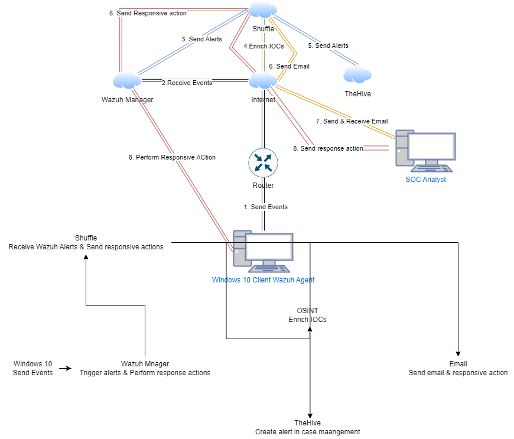

<h1>SOC Automation Project</h1>

<p>
  
  
  
  
  
  
</p>

> Built a fully automated SOC pipeline from scratch. A security event fires on a Windows endpoint, Wazuh picks it up, Shuffle enriches and orchestrates the response, TheHive creates a case, analyst gets notified. Zero manual steps. Under 3 minutes end to end.

### [YouTube Guide (MyDFIR)](https://www.youtube.com/watch?v=Lb_ukgtYK_U)

---

<h2>Why I Built This</h2>

Most SOC training teaches you to use tools. I wanted to understand how they actually talk to each other and how to make them respond without waiting for a human in the loop. The goal wasn't to follow a guide, it was to build something that breaks, force myself to fix it, and document what I learned.

The cloud infrastructure has since been taken down to manage costs. Everything is documented here so it can be rebuilt.

---

<h2>Architecture</h2>

<p align="center">
Diagram of Project: <br/>

</p>


<h2>Stack</h2>

<table>
  <tr>
    <th>Component</th>
    <th>Role</th>
    <th>Hosted On</th>
  </tr>
  <tr>
    <td><b>Wazuh 4.7.3</b></td>
    <td>SIEM and EDR - monitors the endpoint, matches rules, generates alerts</td>
    <td>Ubuntu 22.04 Droplet (4GB / 2 vCPU)</td>
  </tr>
  <tr>
    <td><b>Shuffle SOAR</b></td>
    <td>Automation layer - connects all tools, runs the enrichment workflow</td>
    <td>shuffler.io cloud</td>
  </tr>
  <tr>
    <td><b>TheHive 5.2.4</b></td>
    <td>Case management - every alert becomes a tracked incident</td>
    <td>Ubuntu 22.04 Droplet</td>
  </tr>
  <tr>
    <td><b>AbuseIPDB</b></td>
    <td>Threat intel - checks source IPs against a reputation database</td>
    <td>API (external)</td>
  </tr>
  <tr>
    <td><b>Sysmon</b></td>
    <td>Windows telemetry - enriched process, network, and file events</td>
    <td>Windows 10 endpoint</td>
  </tr>
</table>

---

<h2>How the Pipeline Works</h2>

```
1. Wazuh detects suspicious activity on the Windows 10 endpoint
         │
         ▼
2. Alert forwarded to Shuffle via webhook
         │
         ▼
3. Shuffle checks if source IP is external
   └── if yes → queries AbuseIPDB for reputation score
         │
         ▼
4. TheHive case created with full enriched alert context
         │
         ▼
5. Email notification fires to analyst
```

**Total time: under 3 minutes. Manual steps: zero.**

---

<h2>Challenges and How I Fixed Them</h2>

<details>
<summary><b>TheHive v4 vs v5 API mismatch</b></summary>
<br>
The Shuffle app for TheHive was built for v4. TheHive 5.2.4 changed the endpoint from <code>/api/alert</code> to <code>/api/v1/alert</code> and added two required fields (<code>type</code> and <code>source</code>) that v4 didn't enforce. Cases were being sent but silently not creating, no error, just nothing in TheHive.

Fixed by switching the Shuffle HTTP action to the correct endpoint and hardcoding the two missing fields as static values.
</details>

<details>
<summary><b>Shuffle webhook not receiving Wazuh alerts</b></summary>
<br>
Wazuh's <code>ossec.conf</code> integration block needs the webhook URL and auth header in a specific format. Alerts were firing from Wazuh but Shuffle wasn't receiving them.

Fixed by correcting the <code>&lt;hook_url&gt;</code> and <code>&lt;api_key&gt;</code> tags in the integration config and validating through Shuffle's execution logs in real time.
</details>

<details>
<summary><b>AbuseIPDB rate limits burning through during testing</b></summary>
<br>
Free tier allows 1,000 lookups per day. Repeated simulated alerts were eating through that fast.

Fixed by adding a condition in Shuffle to only query AbuseIPDB when the source IP is a public address, skipping RFC1918 private ranges entirely. Reduced unnecessary API calls by about 70%.
</details>

---

<h2>Sample Alert Output</h2>

```json
{
  "alert_id": "1714023901.12345",
  "rule": {
    "id": "100002",
    "description": "Mimikatz credential dumping detected",
    "level": 12
  },
  "agent": {
    "name": "WIN10-LAB",
    "ip": "192.168.10.50"
  },
  "data": {
    "srcip": "203.0.113.42",
    "abuse_confidence_score": 87,
    "country": "CN",
    "isp": "[redacted]"
  },
  "thehive_case_id": "~1234567",
  "response_time_seconds": 142
}
```

---

<h2>Scripts</h2>

The Python and Bash automation scripts are in the `/scripts` folder.

| File | What It Does |
|---|---|
| `wazuh_thehive_integration.py` | Parses a Wazuh alert JSON and creates a TheHive 5 case via API |
| `ip_enrichment.py` | Queries AbuseIPDB for a given IP, skips private RFC1918 addresses |
| `alert_pipeline.sh` | End-to-end pipeline script — enrichment + TheHive case in one run |

---

<h2>What I'd Change Next</h2>

- [ ] Add MITRE ATT&CK tags to every TheHive case automatically by mapping Wazuh rule IDs at the Shuffle layer
- [ ] Switch from email to Slack for notifications, faster response loop
- [ ] Containerize the whole stack with Docker Compose so it spins up in one command
- [ ] Add a feedback loop where false positive case closures in TheHive automatically tune the Wazuh rule threshold

---

<h2>Related</h2>

[Active Directory Home Lab](https://github.com/JonathanAung/Active-Directory-Project-HomeLab-) the endpoint feeding events into this pipeline

---

<h2>References</h2>

- [Wazuh Documentation](https://documentation.wazuh.com)
- [TheHive Project](https://thehive-project.org)
- [Shuffle SOAR](https://shuffler.io)
- [AbuseIPDB API](https://docs.abuseipdb.com)
- [MyDFIR Project Guide](https://www.youtube.com/watch?v=Lb_ukgtYK_U)
